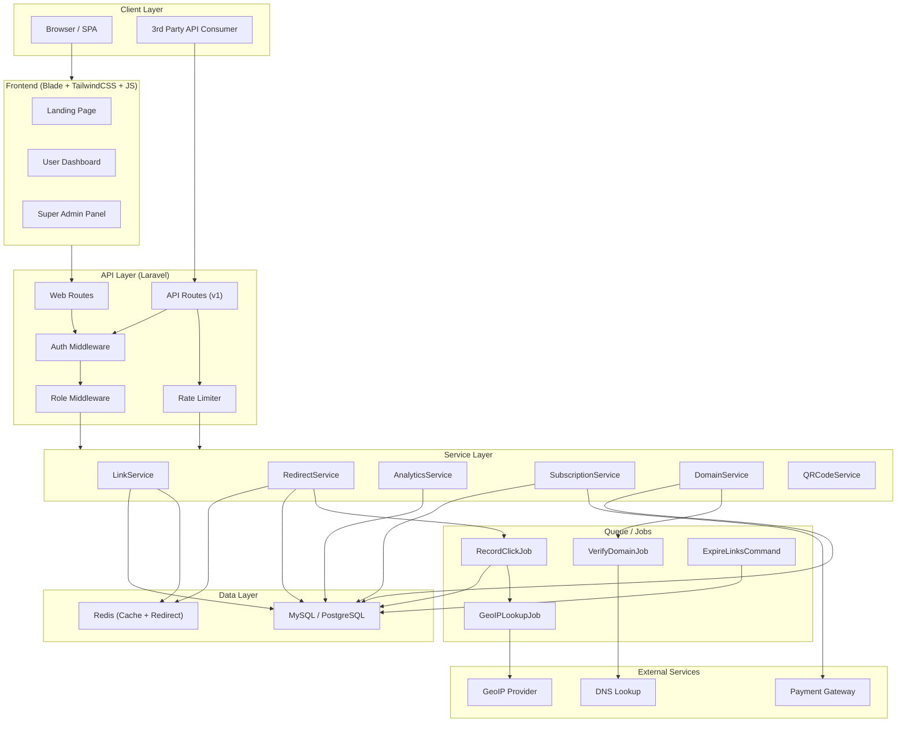
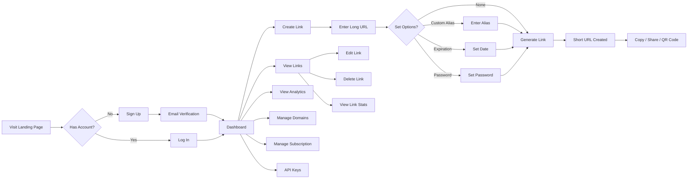
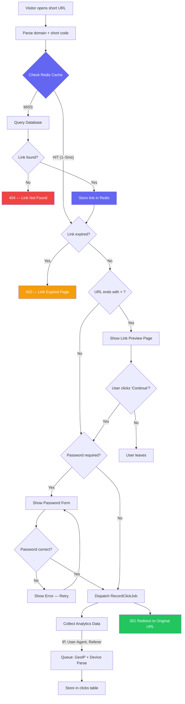
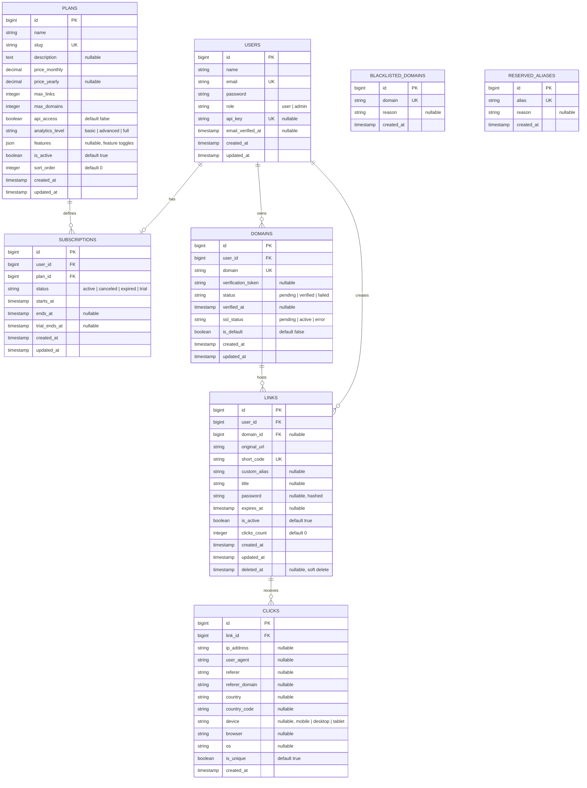
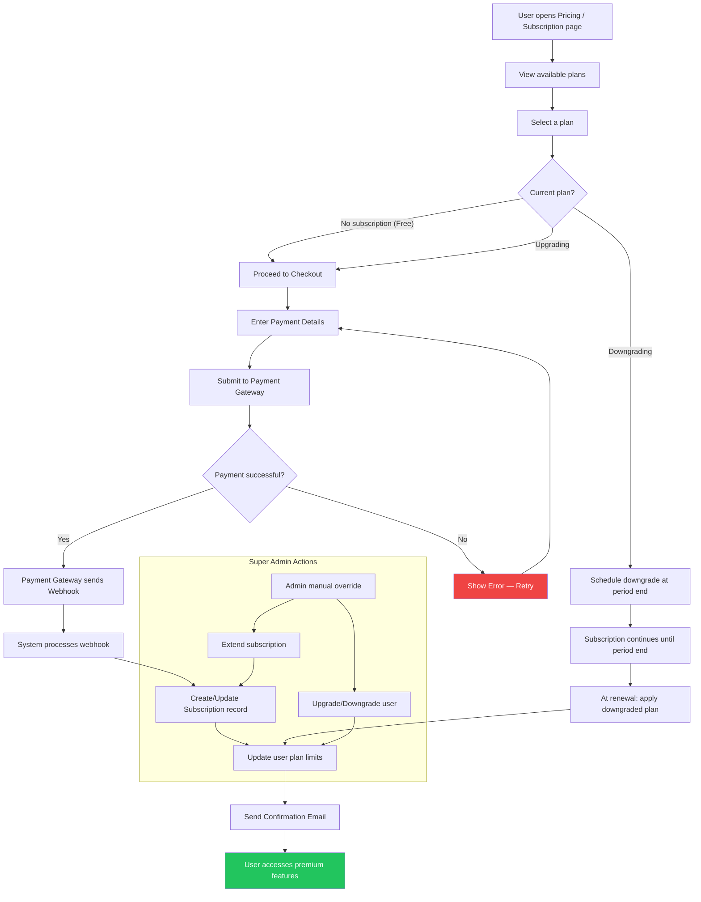
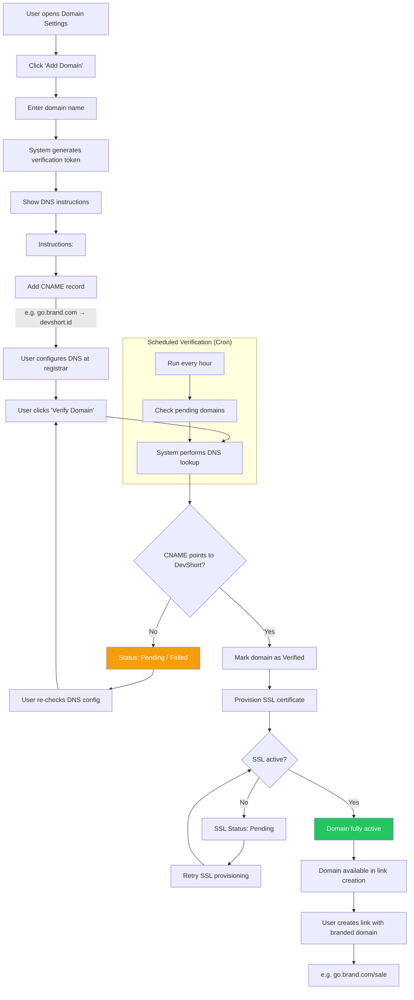

# DevShort — System Architecture & Flows

> System architecture, entity relationships, and core flows for the DevShort SaaS URL Shortener Platform.

---

## Table of Contents

- [System Actors](#system-actors)
- [1. System Architecture Diagram](#1-system-architecture-diagram)
- [2. User Flow Diagram](#2-user-flow-diagram)
- [3. Redirect Flow Diagram](#3-redirect-flow-diagram)
- [4. Database ERD](#4-database-erd)
- [5. Subscription Flow Diagram](#5-subscription-flow-diagram)
- [6. Custom Domain Verification Flow](#6-custom-domain-verification-flow)
- [Component Responsibilities](#component-responsibilities)
- [Design Principles](#design-principles)

---

## System Actors

| Actor | Description | Key Permissions |
|-------|-------------|-----------------|
| **Guest** | Unauthenticated visitor | View landing/pricing, sign up, log in |
| **User** | Registered user | Dashboard, link CRUD, analytics, domains, subscription, API keys |
| **Super Admin** | Platform administrator | Plan CRUD, user management, moderation, platform analytics, domain management |

---

## 1. System Architecture Diagram

High-level overview of how the frontend, API layer, services, and data stores interact.

---

## 2. User Flow Diagram

The journey of a user from landing page through link management.

---

## 3. Redirect Flow Diagram

What happens when a visitor clicks a short link.

---

## 4. Database ERD

Entity-Relationship Diagram for all core database tables.

---

## 5. Subscription Flow Diagram

User journey from plan selection through payment to active subscription.

---

## 6. Custom Domain Verification Flow

Process for connecting and verifying a user's branded domain.

---

## Component Responsibilities

### Service Layer

| Service | Responsibility |
|---------|---------------|
| **LinkService** | Create, update, delete links. Generate unique short codes. Validate aliases and URLs against blacklists. Enforce plan limits. |
| **RedirectService** | Resolve short codes (Redis cache first, then DB). Handle expiration, password checks, and preview logic. Dispatch click recording. |
| **AnalyticsService** | Aggregate click data. Generate reports by time range, device, country, referrer. Provide data for dashboard charts. |
| **SubscriptionService** | Check plan limits and feature access. Handle plan changes. Interface with payment gateway. |
| **DomainService** | Add/remove domains. Generate verification tokens. Perform DNS verification. Manage SSL status. |
| **QRCodeService** | Generate QR codes for links. Support color customization and download in PNG/SVG. |

### Queue Jobs

| Job | Purpose |
|-----|---------|
| **RecordClickJob** | Async click recording — parse user-agent, extract referer domain, dispatch GeoIP lookup. |
| **GeoIPLookupJob** | Resolve IP address to country/region using GeoIP provider. |
| **VerifyDomainJob** | Perform DNS CNAME lookup for pending domain verifications. |
| **ExpireLinksCommand** | Scheduled command — deactivate links past their expiration date. |

---

## Design Principles

| Principle | How We Apply It |
|-----------|----------------|
| **Modular Architecture** | Service classes encapsulate business logic, controllers stay thin, jobs handle async work |
| **Performance** | Redis caching for redirect resolution (< 200ms), queue-based analytics to avoid blocking redirects |
| **Scalability** | Stateless services, queue workers scale independently, database indexing on `short_code` + `domain` |
| **SaaS Best Practices** | Feature gating via plan config, soft limits with upgrade prompts, webhook-driven payment flows |
| **Clean API Design** | Versioned API (`/api/v1/`), Eloquent Resources for consistent responses, Form Request validation |
| **Security** | Hashed passwords for protected links, input sanitization, rate limiting, URL blacklisting |
